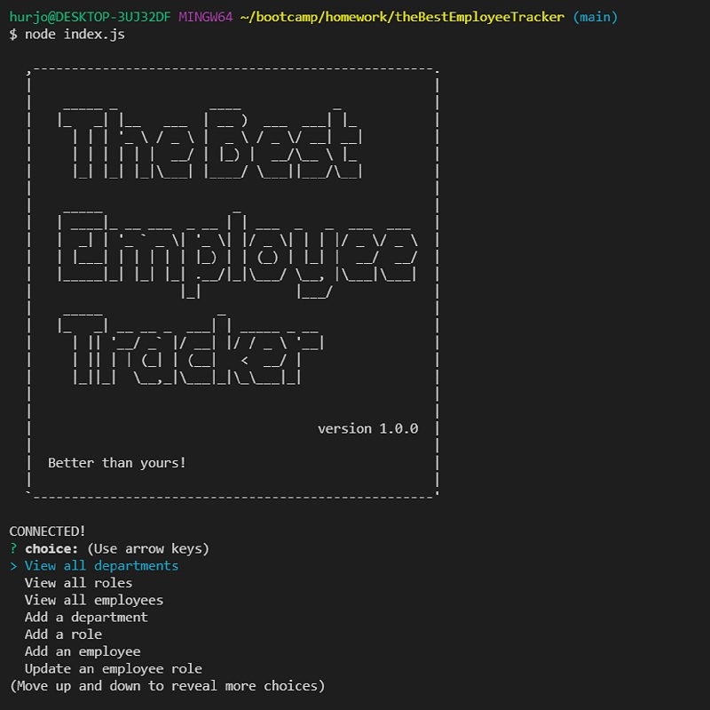
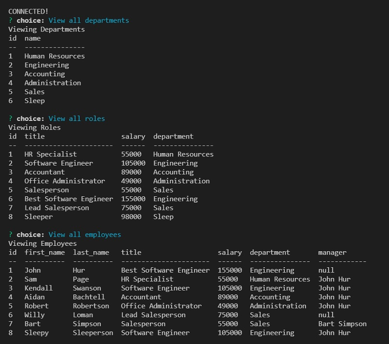
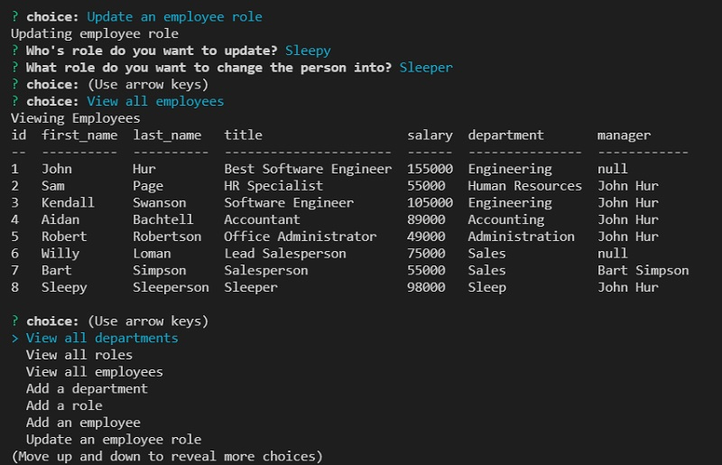

# theBestEmployeeTracker

## Description
I made the Best Employee Tracker.

When the user types in node index.js on their terminal, the user will be presented with options.

The user may view different tables by choosing the option with "View". The user can view a table for all departments, roles, and employees.

The user may add values to the tables by using the "Add" options. The can add a department, role, or employee to their respective tables. The user just needs to follow the prompts, add their desired values will be added to the tables.

The user can update an employee's role with the "Update and employee role" option. The user will be asked which employee they want to change roles for. The user will then be asked which role the employee will be changing into. Then, the employee's role change can viewed in the "View all employees" option.

When the user chooses the "Exit" option, the app will end and the user will be taken back into the terminal.

Thank you and enjoy!

GitHub Repository: [https://github.com/jhur628/theBestEmployeeTracker](https://github.com/jhur628/theBestEmployeeTracker)

Video Demo: [https://watch.screencastify.com/v/o0zQv0KwdQQXFeEDONX2](https://watch.screencastify.com/v/o0zQv0KwdQQXFeEDONX2)

## Table of Contents
### [Installation](#Installation)
### [Usage](#Usage)
### [Credits](#Credits)
### [Questions](#Questions)
### [Screenshots](#Screenshots)

## Installation
Run schema.sql and then seed.sql on mysql. Then, type node index.js in terminal
## Usage
This application will help keep track of employees, roles, and departments. This application will also be useful to make changes to employee's roles.
## Credits
My peers were a big help. I'm very grateful to them. Thank goodness for study groups. I realize I have a lot to learn still.
## Questions
Have any questions?  
Contact me at hur.john628.com.  
Github: https://github.com/jhur628/  
## Screenshots

